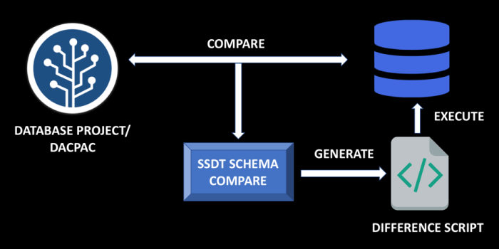
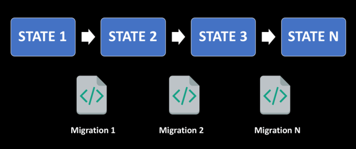

# State based Vs Migrations based

* Pros
  * State is visible and searchable in code – you don't have to script items from SSMS or trawl through all existing changescripts. Also don't need to run all existing changescripts or have access to production/dev sql server to get a glimpse of state.
  * Versioncontrol works for individual objects. Can use git history to view changes to individual tables or SP's over time. Also git merges are easy since objects have separate files.
  * Allows static analysis - SSDT catches certain errors and checks references at compiletime.
  * Refactoring object names can be done in the same manner as usual inside visual studio.
* Cons
  * Autogenerated changescripts often need rewriting if they touch data.
  * If changes have to vary based on configuration tables or separate environments that can be easier in the migration based approach.
  * Server level changes (jobs, traceflags, logins) aren't well supported in SSDT specifically even if you can easily write sql-changescripts for them.

[Database Delivery – State based vs Migration based](https://samirbehara.com/2018/04/16/database-delivery-state-based-vs-migration-based/) (First in google but there might be better ones)

Pictures from the article:

*State based approach:*

*Migrations based approach:*

